# 🐾 Petstore API Client

[](https://www.ruby-lang.org/)
[](https://rspec.info/)
[](https://github.com/hammadxcm/petstore-api-client)
[](LICENSE)
[](https://github.com/hammadxcm)

> Production-ready Ruby client for the Swagger Petstore API with OAuth2 support, automatic retries, and comprehensive validation.
>
> **Author:** Hammad Khan ([@hammadxcm](https://github.com/hammadxcm))
>
> **Note:** All architecture, business logic, implementation, and test coverage were developed by me from scratch. AI tools were used solely to enhance documentation and code comments.

## 🚀 Quick Start

```ruby
gem install petstore_api_client

require 'petstore_api_client'

# Create client
client = PetstoreApiClient::ApiClient.new

# Create a pet
pet = client.create_pet(
  name: "Fluffy",
  photo_urls: ["https://example.com/fluffy.jpg"],
  status: "available"
)
```

## ✨ Features

| Feature                    | Description                                |
|----------------------------|--------------------------------------------|
| 🔐 **Dual Authentication** | API Key & OAuth2 (Client Credentials)      |
| 🔄 **Auto Retry**          | Exponential backoff for transient failures |
| ⚡ **Rate Limiting**        | Smart handling with retry-after support    |
| 📄 **Pagination**          | Flexible page/offset navigation            |
| ✅ **Validation**           | Pre-request data validation                |
| 🛡️ **Error Handling**     | 7 custom exception types                   |
| 📊 **Test Coverage**       | 96.91% coverage, 454 passing tests         |
| 🎯 **SOLID Design**        | Production-ready architecture              |

## 📦 Installation

```bash
# Gemfile
gem 'petstore_api_client'

# Install
bundle install
```

## 🔐 Authentication

The client supports **multiple authentication strategies** with feature flags:


### 🔑 API Key Authentication

```ruby
client = PetstoreApiClient::ApiClient.new
client.configure do |config|
  config.auth_strategy = :api_key  # Default
  config.api_key = "special-key"
end
```

**From Environment:**
```bash
export PETSTORE_API_KEY="your-key"
```
```ruby
config.api_key = :from_env  # Loads from PETSTORE_API_KEY
```

### 🎫 OAuth2 Authentication

```ruby
client.configure do |config|
  config.auth_strategy = :oauth2
  config.oauth2_client_id = "my-client-id"
  config.oauth2_client_secret = "my-secret"
  config.oauth2_scope = "read:pets write:pets"  # Optional
end
```

**OAuth2 Flow:**


**Environment Variables:**
```bash
export PETSTORE_OAUTH2_CLIENT_ID="my-client-id"
export PETSTORE_OAUTH2_CLIENT_SECRET="my-secret"
export PETSTORE_OAUTH2_TOKEN_URL="https://custom.com/token"  # Optional
export PETSTORE_OAUTH2_SCOPE="read:pets write:pets"         # Optional
```

### 🔀 Dual Authentication (Both)

Send **both** API Key and OAuth2 headers simultaneously:

```ruby
client.configure do |config|
  config.auth_strategy = :both
  config.api_key = "special-key"
  config.oauth2_client_id = "client-id"
  config.oauth2_client_secret = "secret"
end

# Requests will include:
# - api_key: special-key
# - Authorization: Bearer {access_token}
```

### 🚫 No Authentication

```ruby
config.auth_strategy = :none  # No auth headers
```

### 🔒 Security Features

| Feature                     | Description                                  |
|-----------------------------|----------------------------------------------|
| ✅ **Credential Validation** | Format & length checks                       |
| ✅ **HTTPS Warnings**        | Alerts for insecure connections              |
| ✅ **Secure Logging**        | API keys masked in output (e.g., `spec****`) |
| ✅ **Token Auto-Refresh**    | OAuth2 tokens refreshed 60s before expiry    |
| ✅ **Thread-Safe**           | Mutex-protected token management             |

## ⚙️ Configuration

<details>
<summary><b>📋 All Configuration Options</b></summary>

| Option                 | Type    | Default                                   | Description                             |
|------------------------|---------|-------------------------------------------|-----------------------------------------|
| `base_url`             | String  | `https://petstore.swagger.io/v2`          | API endpoint                            |
| `auth_strategy`        | Symbol  | `:api_key`                                | `:none`, `:api_key`, `:oauth2`, `:both` |
| `api_key`              | String  | `nil`                                     | API key for authentication              |
| `oauth2_client_id`     | String  | `nil`                                     | OAuth2 client ID                        |
| `oauth2_client_secret` | String  | `nil`                                     | OAuth2 client secret                    |
| `oauth2_token_url`     | String  | `https://petstore.swagger.io/oauth/token` | OAuth2 token endpoint                   |
| `oauth2_scope`         | String  | `nil`                                     | OAuth2 scope                            |
| `timeout`              | Integer | `30`                                      | Request timeout (seconds)               |
| `open_timeout`         | Integer | `10`                                      | Connection timeout (seconds)            |
| `retry_enabled`        | Boolean | `true`                                    | Enable auto-retry                       |
| `max_retries`          | Integer | `2`                                       | Retry attempts                          |
| `default_page_size`    | Integer | `25`                                      | Pagination page size                    |
| `max_page_size`        | Integer | `100`                                     | Max pagination size                     |

</details>

```ruby
client = PetstoreApiClient::ApiClient.new
client.configure do |config|
  config.timeout = 60
  config.retry_enabled = true
  config.max_retries = 3
end
```

## 🔄 Auto-Retry & Rate Limiting

```mermaid
flowchart LR
    A[Request] --> B{Success?}
    B -->|2xx| C[✅ Return]
    B -->|429/5xx| D{Retries<br/>Left?}
    B -->|4xx| E[❌ Error]

    D -->|Yes| F[Wait +<br/>Backoff]
    D -->|No| G[❌ Raise<br/>Error]

    F --> A

    style C fill:#c8e6c9
    style E fill:#ffcdd2
    style G fill:#ffcdd2
    style F fill:#fff9c4
```



**Handles:**
- 🔁 Network failures
- ⏱️ Timeouts
- 🚦 Rate limits (429)
- 🔧 Server errors (500, 502, 503, 504)

```ruby
begin
  pet = client.get_pet(123)
rescue PetstoreApiClient::RateLimitError => e
  puts "Retry after: #{e.retry_after}s"
end
```

## 📚 Usage Examples

### 🐕 Pet Management

```ruby
# Create
pet = client.create_pet(
  name: "Max",
  photo_urls: ["https://example.com/max.jpg"],
  category: { id: 1, name: "Dogs" },
  tags: [{ id: 1, name: "friendly" }],
  status: "available"  # available | pending | sold
)

# Read
pet = client.get_pet(123)

# Update
updated = client.update_pet(
  id: 123,
  name: "Max Updated",
  photo_urls: ["https://example.com/max-new.jpg"],
  status: "sold"
)

# Delete
client.delete_pet(123)

# Find by status (with pagination)
pets = client.pets.find_by_status("available", page: 1, per_page: 10)

# Find by tags
pets = client.pets.find_by_tags(["friendly", "vaccinated"])
```

### 🛒 Store Orders

```ruby
# Create order
order = client.create_order(
  pet_id: 123,
  quantity: 2,
  status: "placed",  # placed | approved | delivered
  ship_date: DateTime.now + 7
)

# Get order
order = client.get_order(987)

# Delete order
client.delete_order(987)
```

### 📄 Pagination

```ruby
pets = client.pets.find_by_status("available", page: 1, per_page: 25)

# Navigation
puts "Page #{pets.page} of #{pets.total_pages}"
puts "Showing #{pets.count} of #{pets.total_count}"

pets.next_page?  # => true
pets.prev_page?  # => false
pets.first_page? # => true
pets.last_page?  # => false

# Iterate
pets.each { |pet| puts pet.name }
pets.map(&:id)
```

## 🛡️ Error Handling

```mermaid
graph TD
    A[PetstoreApiClient::Error] --> B[ValidationError<br/>⚠️ Pre-request]
    A --> C[ConfigurationError<br/>⚙️ Config invalid]
    A --> D[AuthenticationError<br/>🔒 Auth failed]
    A --> E[NotFoundError<br/>❓ 404]
    A --> F[InvalidInputError<br/>⚠️ 400/405]
    A --> G[InvalidOrderError<br/>📦 400 order]
    A --> H[RateLimitError<br/>⏱️ 429]
    A --> I[ConnectionError<br/>🌐 Network]
    A --> J[ApiError<br/>🔧 5xx]

    style A fill:#ffebee
    style D fill:#fff3e0
    style H fill:#fff9c4
```



```ruby
begin
  pet = client.get_pet(999999)
rescue PetstoreApiClient::NotFoundError => e
  puts "Not found: #{e.message}"
rescue PetstoreApiClient::AuthenticationError => e
  puts "Auth failed: #{e.message}"
rescue PetstoreApiClient::ValidationError => e
  puts "Validation: #{e.message}"
rescue PetstoreApiClient::ApiError => e
  puts "API error: #{e.message} (#{e.status_code})"
end
```

## 🏛️ Architecture

```mermaid
graph TB
    A[Your App] --> B[ApiClient]
    B --> C[PetClient]
    B --> D[StoreClient]

    C --> E[Request Module]
    D --> E

    E --> F[Connection]
    F --> G[Middleware Stack]

    G --> H[AuthMiddleware<br/>🔐 Add auth headers]
    H --> I[RetryMiddleware<br/>🔄 Auto-retry]
    I --> J[RateLimitMiddleware<br/>⏱️ Handle 429]
    J --> K[JSON Parser]
    K --> L[Petstore API]

    M[Configuration] -.-> B
    M -.-> F

    N[Authentication<br/>Strategy] --> O[ApiKey]
    N --> P[OAuth2]
    N --> Q[Composite]
    N --> R[None]

    H -.uses.-> N

    style B fill:#e1f5ff
    style C fill:#fff3e0
    style D fill:#fff3e0
    style H fill:#c8e6c9
    style I fill:#fff9c4
    style J fill:#ffcdd2
```



## 🧪 Testing

| Metric                 | Value       |
|------------------------|-------------|
| ✅ **Total Tests**      | 454 passing |
| 📊 **Line Coverage**   | 96.91%      |
| 🔀 **Branch Coverage** | 86.21%      |
| 🎯 **RuboCop**         | 0 offenses  |

### 🚀 Quick Test (From Project Root)

```bash
# One-command test
./bin/test

# Or manually
bundle install
bundle exec rspec

# With detailed output
bundle exec rspec --format documentation

# Lint check
bundle exec rubocop
```

### 📊 Coverage Report

```bash
bundle exec rspec
open coverage/index.html  # Mac
xdg-open coverage/index.html  # Linux
```

### 🎮 Interactive Console

**IRB Console (Pre-configured):**
```bash
bin/console
```

The console automatically loads the gem and creates a `client` instance:

```ruby
# Client is ready to use!
pet = client.create_pet(
  name: "TestDog",
  photo_urls: ["http://example.com/dog.jpg"],
  status: "available"
)
puts "Created: #{pet.name} (ID: #{pet.id})"

# Test OAuth2 authentication
client.configure do |config|
  config.auth_strategy = :oauth2
  config.oauth2_client_id = "test-client"
  config.oauth2_client_secret = "test-secret"
end

# Clean up
client.delete_pet(pet.id)
```

### 🚂 Rails Console Integration

**Option 1: Gemfile Installation**

Add to your Rails `Gemfile`:
```ruby
gem 'petstore_api_client'
```

Then in Rails console:
```ruby
rails console
```

```ruby
# Create client with API Key
client = PetstoreApiClient::ApiClient.new
client.configure do |config|
  config.api_key = ENV['PETSTORE_API_KEY']
  # or
  config.api_key = :from_env
end

# Test it
pet = client.create_pet(
  name: "RailsPet",
  photo_urls: ["https://example.com/rails-pet.jpg"]
)
```

**Option 2: Load from Local Path**

In Rails console:
```ruby
# Load from local gem directory
$LOAD_PATH.unshift('/path/to/petstore-api-client/lib')
require 'petstore_api_client'

# Use it
client = PetstoreApiClient::ApiClient.new
```

**Option 3: Rails Initializer**

Create `config/initializers/petstore.rb`:
```ruby
# config/initializers/petstore.rb
PetstoreApiClient.configure do |config|
  config.auth_strategy = :oauth2
  config.oauth2_client_id = ENV['PETSTORE_OAUTH2_CLIENT_ID']
  config.oauth2_client_secret = ENV['PETSTORE_OAUTH2_CLIENT_SECRET']
  config.timeout = 60
end
```

Then in your Rails app:
```ruby
# app/services/pet_service.rb
class PetService
  def self.create_pet(name:, photo_urls:)
    client = PetstoreApiClient::ApiClient.new
    client.create_pet(
      name: name,
      photo_urls: photo_urls,
      status: 'available'
    )
  rescue PetstoreApiClient::ValidationError => e
    Rails.logger.error("Validation failed: #{e.message}")
    nil
  end
end
```

### 🔐 Environment Setup

**1. Copy environment template:**
```bash
cp .env.example .env
```

**2. Edit `.env` with your credentials:**
```bash
# Choose your auth strategy
PETSTORE_API_KEY=special-key

# OR for OAuth2
PETSTORE_OAUTH2_CLIENT_ID=my-client-id
PETSTORE_OAUTH2_CLIENT_SECRET=my-secret
```

**3. Load in Rails:**
```ruby
# Gemfile
gem 'dotenv-rails', groups: [:development, :test]

# .env is automatically loaded
```

### ⚠️ Security Checklist

Before committing:
```bash
# 1. Check .gitignore includes sensitive files
cat .gitignore | grep -E '\.env|credentials|secrets|\.pem|\.key'

# 2. Verify no secrets in git
git status
git diff

# 3. Check for hardcoded secrets
grep -r "client_secret\|api_key" lib/ --exclude-dir=spec

# 4. Ensure .env is not staged
git ls-files | grep "\.env$" && echo "⚠️  WARNING: .env is tracked!"
```

**Never commit:**
- ❌ `.env` files
- ❌ `credentials.json`
- ❌ `*.pem`, `*.key` files
- ❌ OAuth2 client secrets
- ❌ API keys in code

### 🔄 CI/CD Pipeline

GitHub Actions automatically runs on push/PR:

| Step        | Command               | Purpose                    |
|-------------|-----------------------|----------------------------|
| 🧪 Tests    | `bundle exec rspec`   | Run 454 tests              |
| 🔍 Lint     | `bundle exec rubocop` | Code quality               |
| 🔒 Security | `bundle audit`        | Dependency vulnerabilities |
| 📦 Build    | `gem build`           | Build gem package          |
| 📊 Coverage | Check 95%+ threshold  | Ensure quality             |

**View CI status:**
```
https://github.com/hammadxcm/petstore-api-client/actions
```

**CI/CD Badge:**
```markdown
[](https://github.com/hammadxcm/petstore-api-client/actions)
```

## 📋 API Coverage

| Endpoint            | Method | Client Method                  |
|---------------------|--------|--------------------------------|
| `/pet`              | POST   | `create_pet(data)`             |
| `/pet`              | PUT    | `update_pet(data)`             |
| `/pet/{id}`         | GET    | `get_pet(id)`                  |
| `/pet/{id}`         | DELETE | `delete_pet(id)`               |
| `/pet/findByStatus` | GET    | `find_by_status(status, opts)` |
| `/pet/findByTags`   | GET    | `find_by_tags(tags, opts)`     |
| `/store/order`      | POST   | `create_order(data)`           |
| `/store/order/{id}` | GET    | `get_order(id)`                |
| `/store/order/{id}` | DELETE | `delete_order(id)`             |

## 📖 Documentation

- 🔧 [YARD Docs](https://rubydoc.info/gems/petstore_api_client) - Full API reference
- 📘 Authentication guide is included above (see Authentication section)
- 🚩 Feature flags documented above (see Auth Strategies)

## 🏗️ Design Principles

✅ **SOLID** - Single Responsibility, Open/Closed, Liskov, Interface Segregation, Dependency Inversion
✅ **Strategy Pattern** - Swappable authentication strategies
✅ **Middleware Pattern** - Composable Faraday middleware
✅ **Factory Pattern** - Configuration builds authenticators
✅ **Composite Pattern** - Combine multiple auth strategies
✅ **Null Object** - None authenticator for consistent interface

## 📦 Dependencies

**Runtime:**
- `faraday` (~> 2.0) - HTTP client
- `faraday-retry` (~> 2.0) - Auto-retry middleware
- `oauth2` (~> 2.0) - OAuth2 client
- `activemodel` (>= 6.0) - Validations

**Development:**
- `rspec` (~> 3.12) - Testing
- `vcr` (~> 6.0) - HTTP recording
- `simplecov` (~> 0.22) - Coverage

## 🤝 Contributing

Contributions are welcome! Please feel free to submit a Pull Request.

**How to contribute:**

1. 🍴 Fork it ([https://github.com/hammadxcm/petstore-api-client/fork](https://github.com/hammadxcm/petstore-api-client/fork))
2. 🌿 Create feature branch (`git checkout -b feature/amazing-feature`)
3. ✅ Add tests for your changes
4. 🧪 Run tests (`bundle exec rspec`)
5. 🔍 Run linter (`bundle exec rubocop`)
6. 💾 Commit (`git commit -m 'Add amazing feature'`)
7. 📤 Push (`git push origin feature/amazing-feature`)
8. 🎉 Create Pull Request

**Code owners:** Changes will be automatically reviewed by [@hammadxcm](https://github.com/hammadxcm)

**Guidelines:**
- Write tests for new features
- Follow existing code style
- Update documentation
- Keep commits focused and atomic

## 📄 License

MIT License - see [LICENSE](LICENSE)

---

## 💬 Support & Contact

- 👤 **Author:** Hammad Khan ([@hammadxcm](https://github.com/hammadxcm))
- 🐛 **Issues:** [GitHub Issues](https://github.com/hammadxcm/petstore-api-client/issues)
- 💡 **Feature Requests:** [GitHub Discussions](https://github.com/hammadxcm/petstore-api-client/discussions)
- 📧 **Contact:** [Open an issue](https://github.com/hammadxcm/petstore-api-client/issues/new)
- ⭐ **Star the repo:** [github.com/hammadxcm/petstore-api-client](https://github.com/hammadxcm/petstore-api-client)

---

<div align="center">

**🐾 Made with ❤️ for the Ruby community by [@hammadxcm](https://github.com/hammadxcm)**

[](https://www.ruby-lang.org/)
[](https://oauth.net/2/)
[](LICENSE)
[](https://github.com/hammadxcm)

[Quick Start](#-quick-start) • [Authentication](#-authentication) • [Examples](#-usage-examples) • [Contributing](#-contributing) • [Issues](https://github.com/hammadxcm/petstore-api-client/issues)

**Repository:** [github.com/hammadxcm/petstore-api-client](https://github.com/hammadxcm/petstore-api-client)

</div>
