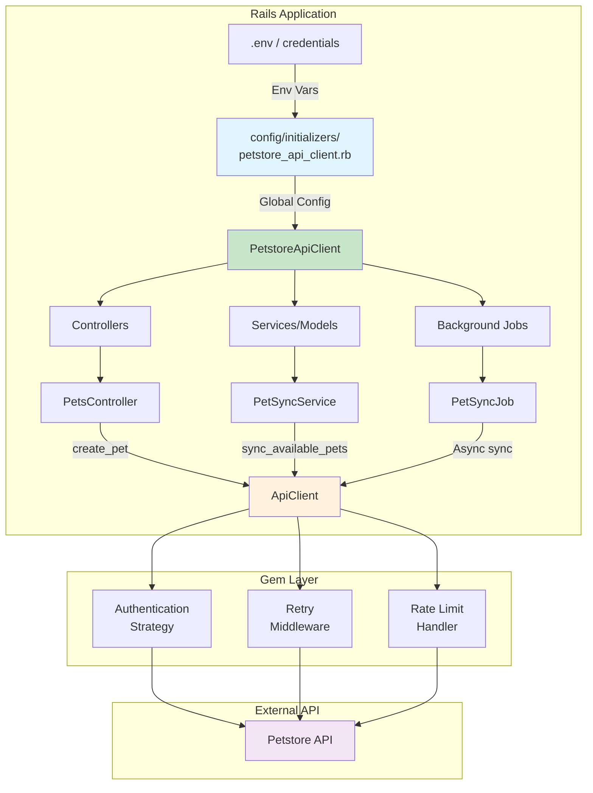
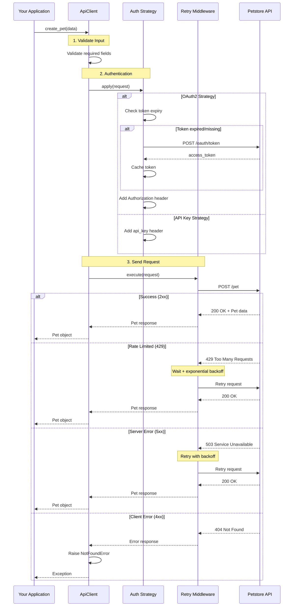

# 🐾 Petstore API Client

[](https://badge.fury.io/rb/petstore_api_client)
[](https://www.ruby-lang.org/)
[](https://rspec.info/)
[](https://github.com/hammadxcm/petstore-api-client)
[](LICENSE)
[](https://github.com/hammadxcm)

---

# ⚠️ AI USAGE DISCLOSURE

## **NO AI was used for CORE CODE**

**AI was ONLY used for:**
- 📝 Documentation (README, guides)
- 📚 YARD documentation comments
- 🔧 Minor code refactoring

**ALL core functionality, architecture, business logic, implementation, and test coverage were developed by me from scratch.**

---

> Production-ready Ruby client for the Swagger Petstore API with OAuth2 support, automatic retries, and comprehensive validation.
>
> **Author:** Hammad Khan ([@hammadxcm](https://github.com/hammadxcm))

## 📑 Table of Contents

- [🚀 Quick Start](#-quick-start)
- [⚡ Quick Copy-Paste Test Commands](#-quick-copy-paste-test-commands)
- [✨ Features](#-features)
- [📦 Installation](#-installation)
  - [From RubyGems (Recommended)](#from-rubygems-recommended)
  - [From Source](#from-source)
  - [Direct Installation](#direct-installation)
- [🔐 Authentication](#-authentication)
  - [🔑 API Key Authentication](#-api-key-authentication)
  - [🎫 OAuth2 Authentication](#-oauth2-authentication)
  - [🔀 Dual Authentication (Both)](#-dual-authentication-both)
- [🚂 Rails Integration](#-rails-integration)
  - [Installation in Rails](#installation-in-rails)
  - [Configuration with Initializer](#configuration-with-initializer)
  - [Usage in Rails Controllers](#usage-in-rails-controllers)
  - [Usage in Rails Models/Services](#usage-in-rails-modelsservices)
  - [Background Jobs (Sidekiq/ActiveJob)](#background-jobs-sidekiqactivejob)
  - [Environment Variables (.env)](#environment-variables-env)
  - [Rails Credentials (Encrypted)](#rails-credentials-encrypted)
  - [Testing with RSpec](#testing-with-rspec)
- [🧪 Testing Gem Installation](#-testing-gem-installation)
  - [Quick Verification](#quick-verification)
  - [Rails Console Testing](#rails-console-testing)
  - [Rails App Integration Test](#rails-app-integration-test)
- [⚙️ Configuration](#️-configuration)
- [🔄 Request Lifecycle](#-request-lifecycle)
- [🔄 Auto-Retry & Rate Limiting](#-auto-retry--rate-limiting)
- [📚 Usage Examples](#-usage-examples)
- [🛡️ Error Handling](#️-error-handling)
- [🏛️ Architecture](#️-architecture)
- [🧪 Testing](#-testing)
- [📋 API Coverage](#-api-coverage)
- [📖 Documentation](#-documentation)
- [🏗️ Design Principles](#️-design-principles)
- [📦 Dependencies](#-dependencies)
- [🤝 Contributing](#-contributing)
- [📄 License](#-license)
- [💬 Support & Contact](#-support--contact)

## 🚀 Quick Start

```ruby
gem install petstore_api_client

require 'petstore_api_client'

# Create client
client = PetstoreApiClient::ApiClient.new

# Create a pet
pet = client.create_pet(
  name: "Fluffy",
  photo_urls: ["https://example.com/fluffy.jpg"],
  status: "available"
)
```

## ⚡ Quick Copy-Paste Test Commands

### 🔹 One-Liner Installation Test
```bash
# Install and verify in one command
gem install petstore_api_client && ruby -e "require 'petstore_api_client'; puts '✅ Gem installed! Version: ' + PetstoreApiClient::VERSION"
```

### 🔹 Quick Ruby Test (Copy entire block)
```ruby
# Paste this entire block into IRB or Ruby console
require 'petstore_api_client'
client = PetstoreApiClient::ApiClient.new
pet = client.create_pet(name: "QuickTest", photo_urls: ["https://example.com/test.jpg"], status: "available")
puts "✅ Created pet: #{pet['name']} (ID: #{pet['id']})"
client.delete_pet(pet['id'])
puts "✅ Cleanup complete!"
```

### 🔹 Rails Console Quick Test (Copy entire block)
```ruby
# Paste this entire block into Rails console
require 'petstore_api_client'
client = PetstoreApiClient::ApiClient.new
client.configure { |c| c.timeout = 30 }
pet = client.create_pet(name: "RailsTest-#{Time.now.to_i}", photo_urls: ["https://example.com/rails.jpg"], status: "available")
puts "✅ Pet created! ID: #{pet['id']}, Name: #{pet['name']}"
fetched = client.get_pet(pet['id'])
puts "✅ Pet fetched! Status: #{fetched['status']}"
client.delete_pet(pet['id'])
puts "✅ Test complete!"
```

### 🔹 Full CRUD Test (Copy entire block)
```ruby
# Complete CRUD operations test - paste this entire block
require 'petstore_api_client'
client = PetstoreApiClient::ApiClient.new

# CREATE
puts "1️⃣  CREATE..."
pet = client.create_pet(name: "TestPet-#{rand(1000)}", photo_urls: ["https://example.com/photo.jpg"], status: "available")
pet_id = pet['id']
puts "   ✅ Created: #{pet['name']} (ID: #{pet_id})"

# READ
puts "2️⃣  READ..."
fetched = client.get_pet(pet_id)
puts "   ✅ Fetched: #{fetched['name']}"

# UPDATE
puts "3️⃣  UPDATE..."
updated = client.update_pet(pet_id, status: 'sold')
puts "   ✅ Updated status to: #{updated['status']}"

# DELETE
puts "4️⃣  DELETE..."
client.delete_pet(pet_id)
puts "   ✅ Deleted pet #{pet_id}"

puts "🎉 All CRUD operations successful!"
```

### 🔹 Authentication Test (OAuth2)
```ruby
# Test OAuth2 authentication - paste this entire block
require 'petstore_api_client'
client = PetstoreApiClient::ApiClient.new
client.configure do |config|
  config.auth_strategy = :oauth2
  config.oauth2_client_id = ENV['PETSTORE_OAUTH2_CLIENT_ID'] || 'test-client'
  config.oauth2_client_secret = ENV['PETSTORE_OAUTH2_CLIENT_SECRET'] || 'test-secret'
end
puts "✅ OAuth2 configured"
puts "   Strategy: #{client.config.auth_strategy}"
puts "   Client ID: #{client.config.oauth2_client_id}"
```

### 🔹 Error Handling Test
```ruby
# Test error handling - paste this entire block
require 'petstore_api_client'
client = PetstoreApiClient::ApiClient.new

# Test NotFoundError
begin
  client.get_pet(999999999)
rescue PetstoreApiClient::NotFoundError => e
  puts "✅ NotFoundError caught correctly"
end

# Test ValidationError
begin
  client.create_pet(name: "", photo_urls: [])
rescue PetstoreApiClient::ValidationError => e
  puts "✅ ValidationError caught correctly"
end

puts "🎉 Error handling works!"
```

## ✨ Features

| Feature                    | Description                                |
|----------------------------|--------------------------------------------|
| 🔐 **Dual Authentication** | API Key & OAuth2 (Client Credentials)      |
| 🔄 **Auto Retry**          | Exponential backoff for transient failures |
| ⚡ **Rate Limiting**        | Smart handling with retry-after support    |
| 📄 **Pagination**          | Flexible page/offset navigation            |
| ✅ **Validation**           | Pre-request data validation                |
| 🛡️ **Error Handling**     | 7 custom exception types                   |
| 📊 **Test Coverage**       | 96.91% coverage, 454 passing tests         |
| 🎯 **SOLID Design**        | Production-ready architecture              |

## 📦 Installation

<details open>
<summary><b>📥 From RubyGems (Recommended)</b></summary>

```ruby
# Gemfile
gem 'petstore_api_client', '~> 0.1.0'
```

Then install:

```bash
bundle install
```

</details>

<details>
<summary><b>📥 From Source</b></summary>

```ruby
# Gemfile
gem 'petstore_api_client', github: 'hammadxcm/petstore-api-client'
```

</details>

<details>
<summary><b>📥 Direct Installation</b></summary>

```bash
gem install petstore_api_client
```

</details>

## 🔐 Authentication

The client supports **multiple authentication strategies** with feature flags:


<details>
<summary><b>🔑 API Key Authentication</b></summary>

```ruby
client = PetstoreApiClient::ApiClient.new
client.configure do |config|
  config.auth_strategy = :api_key  # Default
  config.api_key = "special-key"
end
```

**From Environment:**
```bash
export PETSTORE_API_KEY="your-key"
```
```ruby
config.api_key = :from_env  # Loads from PETSTORE_API_KEY
```

</details>

<details>
<summary><b>🎫 OAuth2 Authentication</b></summary>

```ruby
client.configure do |config|
  config.auth_strategy = :oauth2
  config.oauth2_client_id = "my-client-id"
  config.oauth2_client_secret = "my-secret"
  config.oauth2_scope = "read:pets write:pets"  # Optional
end
```

**OAuth2 Flow:**


**Environment Variables:**
```bash
export PETSTORE_OAUTH2_CLIENT_ID="my-client-id"
export PETSTORE_OAUTH2_CLIENT_SECRET="my-secret"
export PETSTORE_OAUTH2_TOKEN_URL="https://custom.com/token"  # Optional
export PETSTORE_OAUTH2_SCOPE="read:pets write:pets"         # Optional
```

</details>

<details>
<summary><b>🔀 Dual Authentication (Both)</b></summary>

Send **both** API Key and OAuth2 headers simultaneously:

```ruby
client.configure do |config|
  config.auth_strategy = :both
  config.api_key = "special-key"
  config.oauth2_client_id = "client-id"
  config.oauth2_client_secret = "secret"
end

# Requests will include:
# - api_key: special-key
# - Authorization: Bearer {access_token}
```

</details>

<details>
<summary><b>🚫 No Authentication</b></summary>

```ruby
config.auth_strategy = :none  # No auth headers
```

</details>

### 🔒 Security Features

| Feature                     | Description                                  |
|-----------------------------|----------------------------------------------|
| ✅ **Credential Validation** | Format & length checks                       |
| ✅ **HTTPS Warnings**        | Alerts for insecure connections              |
| ✅ **Secure Logging**        | API keys masked in output (e.g., `spec****`) |
| ✅ **Token Auto-Refresh**    | OAuth2 tokens refreshed 60s before expiry    |
| ✅ **Thread-Safe**           | Mutex-protected token management             |

## 🚂 Rails Integration



### Installation in Rails

Add to your `Gemfile`:

```ruby
gem 'petstore_api_client', '~> 0.1.0'
```

Install:

```bash
bundle install
```

<details>
<summary><b>📋 Configuration with Initializer</b></summary>

Create `config/initializers/petstore_api_client.rb`:

```ruby
# config/initializers/petstore_api_client.rb

PetstoreApiClient.configure do |config|
  # Base configuration
  config.base_url = ENV.fetch('PETSTORE_API_URL', 'https://petstore.swagger.io/v2')
  config.timeout = 30
  config.open_timeout = 10

  # Authentication - choose one strategy
  config.auth_strategy = :oauth2  # or :api_key, :both, :none

  # OAuth2 configuration (if using oauth2 or both)
  config.oauth2_client_id = ENV['PETSTORE_OAUTH2_CLIENT_ID']
  config.oauth2_client_secret = ENV['PETSTORE_OAUTH2_CLIENT_SECRET']
  config.oauth2_token_url = ENV['PETSTORE_OAUTH2_TOKEN_URL']
  config.oauth2_scope = 'read:pets write:pets'

  # API Key configuration (if using api_key or both)
  config.api_key = ENV['PETSTORE_API_KEY']

  # Retry configuration
  config.max_retries = 3
  config.retry_statuses = [503, 429]

  # Pagination defaults
  config.default_page_size = 25
end
```

</details>

<details>
<summary><b>📋 Usage in Rails Controllers</b></summary>

```ruby
# app/controllers/pets_controller.rb
class PetsController < ApplicationController
  before_action :initialize_client

  def index
    @pets = @client.find_pets_by_status('available')
    render json: @pets
  rescue PetstoreApiClient::ApiError => e
    render json: { error: e.message }, status: :bad_gateway
  end

  def show
    @pet = @client.get_pet(params[:id])
    render json: @pet
  rescue PetstoreApiClient::NotFoundError => e
    render json: { error: 'Pet not found' }, status: :not_found
  end

  def create
    @pet = @client.create_pet(pet_params)
    render json: @pet, status: :created
  rescue PetstoreApiClient::ValidationError => e
    render json: { errors: e.message }, status: :unprocessable_entity
  end

  def update
    @pet = @client.update_pet(params[:id], pet_params)
    render json: @pet
  rescue PetstoreApiClient::NotFoundError => e
    render json: { error: 'Pet not found' }, status: :not_found
  end

  def destroy
    @client.delete_pet(params[:id])
    head :no_content
  rescue PetstoreApiClient::NotFoundError => e
    render json: { error: 'Pet not found' }, status: :not_found
  end

  private

  def initialize_client
    @client = PetstoreApiClient::ApiClient.new
  end

  def pet_params
    params.require(:pet).permit(:name, :status, photo_urls: [], tags: [:id, :name])
  end
end
```

</details>

<details>
<summary><b>📋 Usage in Rails Models/Services</b></summary>

```ruby
# app/services/pet_sync_service.rb
class PetSyncService
  def initialize
    @client = PetstoreApiClient::ApiClient.new
  end

  def sync_available_pets
    pets = @client.find_pets_by_status('available')

    pets.each do |pet_data|
      Pet.find_or_create_by(external_id: pet_data['id']) do |pet|
        pet.name = pet_data['name']
        pet.status = pet_data['status']
        pet.photo_urls = pet_data['photoUrls']
      end
    end

    pets.count
  rescue PetstoreApiClient::ApiError => e
    Rails.logger.error("Pet sync failed: #{e.message}")
    raise
  end

  def create_remote_pet(local_pet)
    @client.create_pet(
      name: local_pet.name,
      photo_urls: local_pet.photo_urls,
      status: local_pet.status,
      tags: local_pet.tags.map { |tag| { name: tag.name } }
    )
  end
end
```

</details>

<details>
<summary><b>📋 Background Jobs (Sidekiq/ActiveJob)</b></summary>

```ruby
# app/jobs/pet_sync_job.rb
class PetSyncJob < ApplicationJob
  queue_as :default
  retry_on PetstoreApiClient::RateLimitError, wait: :polynomially_longer
  discard_on PetstoreApiClient::AuthenticationError

  def perform
    client = PetstoreApiClient::ApiClient.new
    pets = client.find_pets_by_status('available')

    Rails.logger.info "Synced #{pets.count} pets from Petstore API"
  end
end
```

</details>

<details>
<summary><b>📋 Environment Variables (.env)</b></summary>

```bash
# .env or .env.local
PETSTORE_API_URL=https://petstore.swagger.io/v2
PETSTORE_OAUTH2_CLIENT_ID=your-client-id
PETSTORE_OAUTH2_CLIENT_SECRET=your-client-secret
PETSTORE_OAUTH2_TOKEN_URL=https://petstore.swagger.io/oauth/token
PETSTORE_API_KEY=special-key
```

</details>

<details>
<summary><b>📋 Rails Credentials (Encrypted)</b></summary>

```bash
# Edit credentials
EDITOR=vim rails credentials:edit
```

```yaml
# config/credentials.yml.enc
petstore:
  oauth2_client_id: your-client-id
  oauth2_client_secret: your-secret
  api_key: special-key
```

Access in initializer:

```ruby
# config/initializers/petstore_api_client.rb
PetstoreApiClient.configure do |config|
  credentials = Rails.application.credentials.petstore

  config.oauth2_client_id = credentials[:oauth2_client_id]
  config.oauth2_client_secret = credentials[:oauth2_client_secret]
  config.api_key = credentials[:api_key]
end
```

</details>

<details>
<summary><b>📋 Testing with RSpec</b></summary>

```ruby
# spec/services/pet_sync_service_spec.rb
require 'rails_helper'

RSpec.describe PetSyncService do
  let(:client) { instance_double(PetstoreApiClient::ApiClient) }
  let(:service) { described_class.new }

  before do
    allow(PetstoreApiClient::ApiClient).to receive(:new).and_return(client)
  end

  describe '#sync_available_pets' do
    it 'syncs pets from API' do
      pets_data = [
        { 'id' => 1, 'name' => 'Fluffy', 'status' => 'available', 'photoUrls' => [] }
      ]

      allow(client).to receive(:find_pets_by_status)
        .with('available')
        .and_return(pets_data)

      expect { service.sync_available_pets }.to change(Pet, :count).by(1)
    end

    it 'handles API errors gracefully' do
      allow(client).to receive(:find_pets_by_status)
        .and_raise(PetstoreApiClient::ApiError, 'API is down')

      expect { service.sync_available_pets }.to raise_error(PetstoreApiClient::ApiError)
    end
  end
end
```

</details>

## 🧪 Testing Gem Installation

### Quick Verification

After installing the gem, verify it's working correctly:

```bash
# Install the gem
gem install petstore_api_client

# Verify installation
gem list petstore_api_client

# Check version
ruby -e "require 'petstore_api_client'; puts PetstoreApiClient::VERSION"
```

Expected output:
```
petstore_api_client (0.1.0)
0.1.0
```

<details>
<summary><b>📋 Rails Console Testing (Detailed Examples)</b></summary>

### Rails Console Testing

#### 1. Add Gem to Rails App

```ruby
# Gemfile
gem 'petstore_api_client', '~> 0.1.0'
```

```bash
bundle install
```

#### 2. Test in Rails Console

```bash
rails console
```

**Basic Connectivity Test:**

```ruby
# Load the gem
require 'petstore_api_client'

# Create a client (using default configuration)
client = PetstoreApiClient::ApiClient.new

# Test basic functionality - get a pet by ID
# Note: Petstore API has some demo pets available
pet = client.get_pet(1)
puts "Pet Name: #{pet['name']}"
puts "Status: #{pet['status']}"

# Success! ✅ If you see pet data, the gem is working
```

**Configuration Test:**

```ruby
# Test with custom configuration
PetstoreApiClient.configure do |config|
  config.timeout = 60
  config.auth_strategy = :api_key
  config.api_key = 'special-key'  # Petstore demo API key
end

# Create client with configuration
client = PetstoreApiClient::ApiClient.new

# Verify configuration was applied
puts "Timeout: #{client.config.timeout}"
puts "Auth Strategy: #{client.config.auth_strategy}"

# Test authenticated request
client.get_pet(1)
# Success! ✅ Configuration is working
```

**CRUD Operations Test:**

```ruby
# CREATE - Add a new pet
new_pet = client.create_pet(
  name: "Rails Test Pet",
  photo_urls: ["https://example.com/photo.jpg"],
  status: "available",
  tags: [{ name: "test" }]
)

puts "Created Pet ID: #{new_pet['id']}"
pet_id = new_pet['id']

# READ - Get the pet we just created
pet = client.get_pet(pet_id)
puts "Retrieved Pet: #{pet['name']}"

# UPDATE - Change the pet's status
updated_pet = client.update_pet(pet_id, status: 'sold')
puts "Updated Status: #{updated_pet['status']}"

# DELETE - Remove the pet
client.delete_pet(pet_id)
puts "Pet deleted successfully!"

# Success! ✅ All CRUD operations working
```

**Error Handling Test:**

```ruby
# Test error handling with invalid ID
begin
  client.get_pet(999999999)
rescue PetstoreApiClient::NotFoundError => e
  puts "✅ NotFoundError caught correctly: #{e.message}"
end

# Test validation error
begin
  client.create_pet(name: "", photo_urls: [])  # Invalid data
rescue PetstoreApiClient::ValidationError => e
  puts "✅ ValidationError caught correctly: #{e.message}"
end

# Success! ✅ Error handling is working
```

**Pagination Test:**

```ruby
# Test finding pets by status with pagination
available_pets = client.find_pets_by_status('available')
puts "Found #{available_pets.count} available pets"

# Show first few pets
available_pets.first(3).each do |pet|
  puts "- #{pet['name']} (ID: #{pet['id']})"
end

# Success! ✅ Pagination working
```

</details>

<details>
<summary><b>📋 Rails App Integration Test (Detailed Example)</b></summary>

### Rails App Integration Test

Create a test controller to verify full integration:

#### 1. Generate Test Controller

```bash
rails generate controller PetTest index create
```

#### 2. Update Controller

```ruby
# app/controllers/pet_test_controller.rb
class PetTestController < ApplicationController
  before_action :initialize_client

  # GET /pet_test
  def index
    @pets = @client.find_pets_by_status('available')
    render json: {
      success: true,
      count: @pets.count,
      pets: @pets.first(5)
    }
  rescue PetstoreApiClient::ApiError => e
    render json: { success: false, error: e.message }, status: :bad_gateway
  end

  # POST /pet_test
  def create
    @pet = @client.create_pet(
      name: params[:name] || "Test Pet #{Time.now.to_i}",
      photo_urls: [params[:photo_url] || "https://example.com/pet.jpg"],
      status: params[:status] || "available"
    )

    render json: {
      success: true,
      message: "Pet created successfully",
      pet: @pet
    }, status: :created
  rescue PetstoreApiClient::ValidationError => e
    render json: { success: false, errors: e.message }, status: :unprocessable_entity
  rescue PetstoreApiClient::ApiError => e
    render json: { success: false, error: e.message }, status: :bad_gateway
  end

  private

  def initialize_client
    @client = PetstoreApiClient::ApiClient.new
  end
end
```

#### 3. Add Routes

```ruby
# config/routes.rb
Rails.application.routes.draw do
  get 'pet_test', to: 'pet_test#index'
  post 'pet_test', to: 'pet_test#create'
end
```

#### 4. Start Rails Server

```bash
rails server
```

#### 5. Test Endpoints

**Test GET request:**
```bash
curl http://localhost:3000/pet_test
```

Expected response:
```json
{
  "success": true,
  "count": 10,
  "pets": [...]
}
```

**Test POST request:**
```bash
curl -X POST http://localhost:3000/pet_test \
  -H "Content-Type: application/json" \
  -d '{"name":"Fluffy","status":"available"}'
```

Expected response:
```json
{
  "success": true,
  "message": "Pet created successfully",
  "pet": {
    "id": 12345,
    "name": "Fluffy",
    "status": "available"
  }
}
```

✅ **Success!** If both requests work, the gem is fully integrated with your Rails app!

</details>

<details>
<summary><b>📋 Troubleshooting & Performance Testing</b></summary>

### Troubleshooting

**Gem not found:**
```bash
# Verify gem is installed
bundle list | grep petstore_api_client

# Reinstall if needed
bundle install
```

**Configuration not loading:**
```bash
# Check if initializer was loaded
rails runner "puts PetstoreApiClient.configuration.inspect"
```

**Connection errors:**
```ruby
# Test network connectivity
require 'net/http'
uri = URI('https://petstore.swagger.io/v2/pet/1')
response = Net::HTTP.get_response(uri)
puts response.code  # Should be "200"
```

**SSL certificate errors:**
```ruby
# Temporarily disable SSL verification (development only!)
require 'openssl'
OpenSSL::SSL::VERIFY_PEER = OpenSSL::SSL::VERIFY_NONE
```

### Performance Testing

Test gem performance in Rails console:

```ruby
require 'benchmark'

client = PetstoreApiClient::ApiClient.new

# Single request benchmark
time = Benchmark.realtime do
  client.get_pet(1)
end
puts "Single request: #{(time * 1000).round(2)}ms"

# Multiple requests benchmark
time = Benchmark.realtime do
  10.times { client.get_pet(1) }
end
puts "10 requests: #{(time * 1000).round(2)}ms"
puts "Average: #{(time * 100).round(2)}ms per request"
```

### Integration Test Checklist

- ✅ Gem installs without errors
- ✅ Basic client initialization works
- ✅ Configuration can be set globally
- ✅ CRUD operations function correctly
- ✅ Error handling catches exceptions
- ✅ Pagination returns results
- ✅ Rails controller integration works
- ✅ API requests complete successfully
- ✅ Performance is acceptable

</details>

## ⚙️ Configuration

<details>
<summary><b>📋 All Configuration Options</b></summary>

| Option                 | Type    | Default                                   | Description                             |
|------------------------|---------|-------------------------------------------|-----------------------------------------|
| `base_url`             | String  | `https://petstore.swagger.io/v2`          | API endpoint                            |
| `auth_strategy`        | Symbol  | `:api_key`                                | `:none`, `:api_key`, `:oauth2`, `:both` |
| `api_key`              | String  | `nil`                                     | API key for authentication              |
| `oauth2_client_id`     | String  | `nil`                                     | OAuth2 client ID                        |
| `oauth2_client_secret` | String  | `nil`                                     | OAuth2 client secret                    |
| `oauth2_token_url`     | String  | `https://petstore.swagger.io/oauth/token` | OAuth2 token endpoint                   |
| `oauth2_scope`         | String  | `nil`                                     | OAuth2 scope                            |
| `timeout`              | Integer | `30`                                      | Request timeout (seconds)               |
| `open_timeout`         | Integer | `10`                                      | Connection timeout (seconds)            |
| `retry_enabled`        | Boolean | `true`                                    | Enable auto-retry                       |
| `max_retries`          | Integer | `2`                                       | Retry attempts                          |
| `default_page_size`    | Integer | `25`                                      | Pagination page size                    |
| `max_page_size`        | Integer | `100`                                     | Max pagination size                     |

</details>

```ruby
client = PetstoreApiClient::ApiClient.new
client.configure do |config|
  config.timeout = 60
  config.retry_enabled = true
  config.max_retries = 3
end
```

## 🔄 Request Lifecycle



## 🔄 Auto-Retry & Rate Limiting

```mermaid
flowchart LR
    A[Request] --> B{Success?}
    B -->|2xx| C[✅ Return]
    B -->|429/5xx| D{Retries<br/>Left?}
    B -->|4xx| E[❌ Error]

    D -->|Yes| F[Wait +<br/>Backoff]
    D -->|No| G[❌ Raise<br/>Error]

    F --> A

    style C fill:#c8e6c9
    style E fill:#ffcdd2
    style G fill:#ffcdd2
    style F fill:#fff9c4
```



**Handles:**
- 🔁 Network failures
- ⏱️ Timeouts
- 🚦 Rate limits (429)
- 🔧 Server errors (500, 502, 503, 504)

```ruby
begin
  pet = client.get_pet(123)
rescue PetstoreApiClient::RateLimitError => e
  puts "Retry after: #{e.retry_after}s"
end
```

## 📚 Usage Examples

<details>
<summary><b>📋 Pet Management (CRUD Operations)</b></summary>

```ruby
# Create
pet = client.create_pet(
  name: "Max",
  photo_urls: ["https://example.com/max.jpg"],
  category: { id: 1, name: "Dogs" },
  tags: [{ id: 1, name: "friendly" }],
  status: "available"  # available | pending | sold
)

# Read
pet = client.get_pet(123)

# Update
updated = client.update_pet(
  id: 123,
  name: "Max Updated",
  photo_urls: ["https://example.com/max-new.jpg"],
  status: "sold"
)

# Delete
client.delete_pet(123)

# Find by status (with pagination)
pets = client.pets.find_by_status("available", page: 1, per_page: 10)

# Find by tags
pets = client.pets.find_by_tags(["friendly", "vaccinated"])
```

</details>

<details>
<summary><b>📋 Store Orders</b></summary>

```ruby
# Create order
order = client.create_order(
  pet_id: 123,
  quantity: 2,
  status: "placed",  # placed | approved | delivered
  ship_date: DateTime.now + 7
)

# Get order
order = client.get_order(987)

# Delete order
client.delete_order(987)
```

</details>

<details>
<summary><b>📋 Pagination Examples</b></summary>

```ruby
pets = client.pets.find_by_status("available", page: 1, per_page: 25)

# Navigation
puts "Page #{pets.page} of #{pets.total_pages}"
puts "Showing #{pets.count} of #{pets.total_count}"

pets.next_page?  # => true
pets.prev_page?  # => false
pets.first_page? # => true
pets.last_page?  # => false

# Iterate
pets.each { |pet| puts pet.name }
pets.map(&:id)
```

</details>

## 🛡️ Error Handling

```mermaid
graph TD
    A[PetstoreApiClient::Error] --> B[ValidationError<br/>⚠️ Pre-request]
    A --> C[ConfigurationError<br/>⚙️ Config invalid]
    A --> D[AuthenticationError<br/>🔒 Auth failed]
    A --> E[NotFoundError<br/>❓ 404]
    A --> F[InvalidInputError<br/>⚠️ 400/405]
    A --> G[InvalidOrderError<br/>📦 400 order]
    A --> H[RateLimitError<br/>⏱️ 429]
    A --> I[ConnectionError<br/>🌐 Network]
    A --> J[ApiError<br/>🔧 5xx]

    style A fill:#ffebee
    style D fill:#fff3e0
    style H fill:#fff9c4
```



```ruby
begin
  pet = client.get_pet(999999)
rescue PetstoreApiClient::NotFoundError => e
  puts "Not found: #{e.message}"
rescue PetstoreApiClient::AuthenticationError => e
  puts "Auth failed: #{e.message}"
rescue PetstoreApiClient::ValidationError => e
  puts "Validation: #{e.message}"
rescue PetstoreApiClient::ApiError => e
  puts "API error: #{e.message} (#{e.status_code})"
end
```

## 🏛️ Architecture

```mermaid
graph TB
    A[Your App] --> B[ApiClient]
    B --> C[PetClient]
    B --> D[StoreClient]

    C --> E[Request Module]
    D --> E

    E --> F[Connection]
    F --> G[Middleware Stack]

    G --> H[AuthMiddleware<br/>🔐 Add auth headers]
    H --> I[RetryMiddleware<br/>🔄 Auto-retry]
    I --> J[RateLimitMiddleware<br/>⏱️ Handle 429]
    J --> K[JSON Parser]
    K --> L[Petstore API]

    M[Configuration] -.-> B
    M -.-> F

    N[Authentication<br/>Strategy] --> O[ApiKey]
    N --> P[OAuth2]
    N --> Q[Composite]
    N --> R[None]

    H -.uses.-> N

    style B fill:#e1f5ff
    style C fill:#fff3e0
    style D fill:#fff3e0
    style H fill:#c8e6c9
    style I fill:#fff9c4
    style J fill:#ffcdd2
```



## 🧪 Testing

| Metric                 | Value       |
|------------------------|-------------|
| ✅ **Total Tests**      | 454 passing |
| 📊 **Line Coverage**   | 96.91%      |
| 🔀 **Branch Coverage** | 86.21%      |
| 🎯 **RuboCop**         | 0 offenses  |

### 🚀 Quick Test (From Project Root)

```bash
# One-command test
./bin/test

# Or manually
bundle install
bundle exec rspec

# With detailed output
bundle exec rspec --format documentation

# Lint check
bundle exec rubocop
```

### 📊 Coverage Report

```bash
bundle exec rspec
open coverage/index.html  # Mac
xdg-open coverage/index.html  # Linux
```

<details>
<summary><b>📋 Interactive Console & Development Setup</b></summary>

### 🎮 Interactive Console

**IRB Console (Pre-configured):**
```bash
bin/console
```

The console automatically loads the gem and creates a `client` instance:

```ruby
# Client is ready to use!
pet = client.create_pet(
  name: "TestDog",
  photo_urls: ["http://example.com/dog.jpg"],
  status: "available"
)
puts "Created: #{pet.name} (ID: #{pet.id})"

# Test OAuth2 authentication
client.configure do |config|
  config.auth_strategy = :oauth2
  config.oauth2_client_id = "test-client"
  config.oauth2_client_secret = "test-secret"
end

# Clean up
client.delete_pet(pet.id)
```

### 🚂 Rails Console Integration

**Option 1: Gemfile Installation**

Add to your Rails `Gemfile`:
```ruby
gem 'petstore_api_client'
```

Then in Rails console:
```ruby
rails console
```

**Test with all authentication strategies:**

```ruby
# =====================================
# Strategy 1: No Authentication (:none)
# =====================================
client = PetstoreApiClient::ApiClient.new
client.configure do |config|
  config.auth_strategy = :none
end
pet = client.create_pet(
  name: "RailsPet-NoAuth-#{Time.now.to_i}",
  photo_urls: ["https://example.com/rails-pet.jpg"]
)
puts "✅ Created with :none auth: #{pet['name']}"

# =====================================
# Strategy 2: API Key Authentication
# =====================================
client = PetstoreApiClient::ApiClient.new
client.configure do |config|
  config.auth_strategy = :api_key
  config.api_key = ENV['PETSTORE_API_KEY']  # or 'special-key'
  # Alternative: config.api_key = :from_env (reads from PETSTORE_API_KEY)
end
pet = client.create_pet(
  name: "RailsPet-ApiKey-#{Time.now.to_i}",
  photo_urls: ["https://example.com/rails-pet.jpg"]
)
puts "✅ Created with :api_key auth: #{pet['name']}"

# =====================================
# Strategy 3: OAuth2 Authentication
# =====================================
client = PetstoreApiClient::ApiClient.new
client.configure do |config|
  config.auth_strategy = :oauth2
  config.oauth2_client_id = ENV['PETSTORE_OAUTH2_CLIENT_ID']
  config.oauth2_client_secret = ENV['PETSTORE_OAUTH2_CLIENT_SECRET']
  config.oauth2_scope = 'read:pets write:pets'  # Optional
end
pet = client.create_pet(
  name: "RailsPet-OAuth2-#{Time.now.to_i}",
  photo_urls: ["https://example.com/rails-pet.jpg"]
)
puts "✅ Created with :oauth2 auth: #{pet['name']}"

# =====================================
# Strategy 4: Dual Authentication (:both)
# =====================================
client = PetstoreApiClient::ApiClient.new
client.configure do |config|
  config.auth_strategy = :both
  config.api_key = ENV['PETSTORE_API_KEY']
  config.oauth2_client_id = ENV['PETSTORE_OAUTH2_CLIENT_ID']
  config.oauth2_client_secret = ENV['PETSTORE_OAUTH2_CLIENT_SECRET']
end
pet = client.create_pet(
  name: "RailsPet-Both-#{Time.now.to_i}",
  photo_urls: ["https://example.com/rails-pet.jpg"]
)
puts "✅ Created with :both auth: #{pet['name']}"
```

**Option 2: Load from Local Path**

In Rails console:
```ruby
# Load from local gem directory
$LOAD_PATH.unshift('/path/to/petstore-api-client/lib')
require 'petstore_api_client'

# Use it
client = PetstoreApiClient::ApiClient.new
```

**Option 3: Rails Initializer**

Create `config/initializers/petstore.rb`:
```ruby
# config/initializers/petstore.rb
PetstoreApiClient.configure do |config|
  config.auth_strategy = :oauth2
  config.oauth2_client_id = ENV['PETSTORE_OAUTH2_CLIENT_ID']
  config.oauth2_client_secret = ENV['PETSTORE_OAUTH2_CLIENT_SECRET']
  config.timeout = 60
end
```

Then in your Rails app:
```ruby
# app/services/pet_service.rb
class PetService
  def self.create_pet(name:, photo_urls:)
    client = PetstoreApiClient::ApiClient.new
    client.create_pet(
      name: name,
      photo_urls: photo_urls,
      status: 'available'
    )
  rescue PetstoreApiClient::ValidationError => e
    Rails.logger.error("Validation failed: #{e.message}")
    nil
  end
end
```

### 🔐 Environment Setup

**1. Copy environment template:**
```bash
cp .env.example .env
```

**2. Edit `.env` with your credentials:**
```bash
# Choose your auth strategy
PETSTORE_API_KEY=special-key

# OR for OAuth2
PETSTORE_OAUTH2_CLIENT_ID=my-client-id
PETSTORE_OAUTH2_CLIENT_SECRET=my-secret
```

**3. Load in Rails:**
```ruby
# Gemfile
gem 'dotenv-rails', groups: [:development, :test]

# .env is automatically loaded
```

### ⚠️ Security Checklist

Before committing:
```bash
# 1. Check .gitignore includes sensitive files
cat .gitignore | grep -E '\.env|credentials|secrets|\.pem|\.key'

# 2. Verify no secrets in git
git status
git diff

# 3. Check for hardcoded secrets
grep -r "client_secret\|api_key" lib/ --exclude-dir=spec

# 4. Ensure .env is not staged
git ls-files | grep "\.env$" && echo "⚠️  WARNING: .env is tracked!"
```

**Never commit:**
- ❌ `.env` files
- ❌ `credentials.json`
- ❌ `*.pem`, `*.key` files
- ❌ OAuth2 client secrets
- ❌ API keys in code

### 🔄 CI/CD Pipeline

GitHub Actions automatically runs on push/PR:

| Step        | Command               | Purpose                    |
|-------------|-----------------------|----------------------------|
| 🧪 Tests    | `bundle exec rspec`   | Run 454 tests              |
| 🔍 Lint     | `bundle exec rubocop` | Code quality               |
| 🔒 Security | `bundle audit`        | Dependency vulnerabilities |
| 📦 Build    | `gem build`           | Build gem package          |
| 📊 Coverage | Check 95%+ threshold  | Ensure quality             |

**View CI status:**
```
https://github.com/hammadxcm/petstore-api-client/actions
```

**CI/CD Badge:**
```markdown
[](https://github.com/hammadxcm/petstore-api-client/actions)
```

</details>

## 📋 API Coverage

| Endpoint            | Method | Client Method                  |
|---------------------|--------|--------------------------------|
| `/pet`              | POST   | `create_pet(data)`             |
| `/pet`              | PUT    | `update_pet(data)`             |
| `/pet/{id}`         | GET    | `get_pet(id)`                  |
| `/pet/{id}`         | DELETE | `delete_pet(id)`               |
| `/pet/findByStatus` | GET    | `find_by_status(status, opts)` |
| `/pet/findByTags`   | GET    | `find_by_tags(tags, opts)`     |
| `/store/order`      | POST   | `create_order(data)`           |
| `/store/order/{id}` | GET    | `get_order(id)`                |
| `/store/order/{id}` | DELETE | `delete_order(id)`             |

## 📖 Documentation

- 🔧 [YARD Docs](https://rubydoc.info/gems/petstore_api_client) - Full API reference
- 📘 Authentication guide is included above (see Authentication section)
- 🚩 Feature flags documented above (see Auth Strategies)

<details>
<summary><b>🏗️ Design Principles</b></summary>

✅ **SOLID** - Single Responsibility, Open/Closed, Liskov, Interface Segregation, Dependency Inversion
✅ **Strategy Pattern** - Swappable authentication strategies
✅ **Middleware Pattern** - Composable Faraday middleware
✅ **Factory Pattern** - Configuration builds authenticators
✅ **Composite Pattern** - Combine multiple auth strategies
✅ **Null Object** - None authenticator for consistent interface

</details>

<details>
<summary><b>📦 Dependencies</b></summary>

**Runtime:**
- `faraday` (~> 2.0) - HTTP client
- `faraday-retry` (~> 2.0) - Auto-retry middleware
- `oauth2` (~> 2.0) - OAuth2 client
- `activemodel` (>= 6.0) - Validations

**Development:**
- `rspec` (~> 3.12) - Testing
- `vcr` (~> 6.0) - HTTP recording
- `simplecov` (~> 0.22) - Coverage

</details>

<details>
<summary><b>🤝 Contributing</b></summary>

Contributions are welcome! Please feel free to submit a Pull Request.

**How to contribute:**

1. 🍴 Fork it ([https://github.com/hammadxcm/petstore-api-client/fork](https://github.com/hammadxcm/petstore-api-client/fork))
2. 🌿 Create feature branch (`git checkout -b feature/amazing-feature`)
3. ✅ Add tests for your changes
4. 🧪 Run tests (`bundle exec rspec`)
5. 🔍 Run linter (`bundle exec rubocop`)
6. 💾 Commit (`git commit -m 'Add amazing feature'`)
7. 📤 Push (`git push origin feature/amazing-feature`)
8. 🎉 Create Pull Request

**Code owners:** Changes will be automatically reviewed by [@hammadxcm](https://github.com/hammadxcm)

**Guidelines:**
- Write tests for new features
- Follow existing code style
- Update documentation
- Keep commits focused and atomic

</details>

## 📄 License

MIT License - see [LICENSE](LICENSE)

---

## 💬 Support & Contact

- 👤 **Author:** Hammad Khan ([@hammadxcm](https://github.com/hammadxcm))
- 🐛 **Issues:** [GitHub Issues](https://github.com/hammadxcm/petstore-api-client/issues)
- 💡 **Feature Requests:** [GitHub Discussions](https://github.com/hammadxcm/petstore-api-client/discussions)
- 📧 **Contact:** [Open an issue](https://github.com/hammadxcm/petstore-api-client/issues/new)
- ⭐ **Star the repo:** [github.com/hammadxcm/petstore-api-client](https://github.com/hammadxcm/petstore-api-client)

---

<div align="center">

**🐾 Made with ❤️ for the Ruby community by [@hammadxcm](https://github.com/hammadxcm)**

[](https://www.ruby-lang.org/)
[](https://oauth.net/2/)
[](LICENSE)
[](https://github.com/hammadxcm)

[Quick Start](#-quick-start) • [Authentication](#-authentication) • [Examples](#-usage-examples) • [Contributing](#-contributing) • [Issues](https://github.com/hammadxcm/petstore-api-client/issues)

**Repository:** [github.com/hammadxcm/petstore-api-client](https://github.com/hammadxcm/petstore-api-client)

</div>
